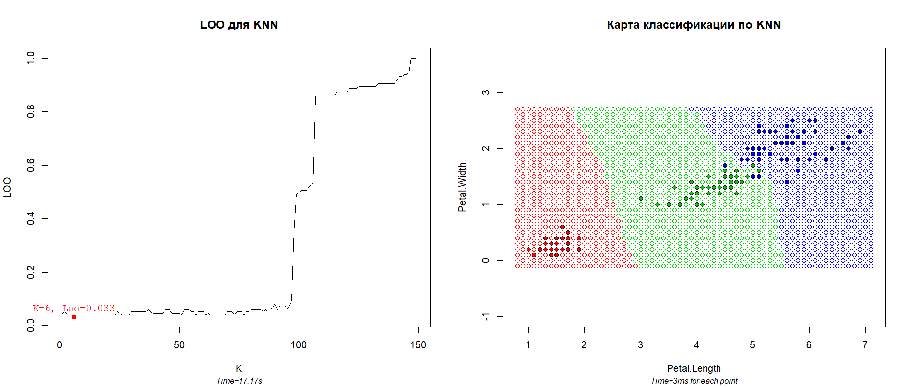

# KNN

### Теория

**KNN** - метрический алгоритм классификации, где в качестве оценки
близости объекта

к классу

выступает функция-индикатор
![w(i,u) <= [i <= k]](http://www.sciweavers.org/tex2img.php?eq=w_y%28i%2C%20u%29%20%3D%20%5Bi%20%20%5Cleq%20%20k%5D&bc=White&fc=Black&im=png&fs=12&ff=arev&edit=0),
где

— порядок ближайшего соседа к классифицируемой точке
.

Алгоритм **KNN** зависит от параметра _k_, который варьируется от
_k = 1_ (_1NN_) до _k = l_ (константа).

Для определения лучшего параметра _k_ будем использовать **LOO (leave-one-out)**

### Программная реализация

Исходный код программы: [KNN.R](../KNN.R)

Функция `mc.KNN(sortedDistances, k)` получает на вход 2 аргумента:
- `sortedDistances` отсортированный массив расстояний от точек выборки к
точке _u_ , при чем массив <u>именованный</u>, именами служат
соответствующие классы точек;
- `k` количество соседей, вес которых стоит учитывать.

Функция `mc.LOO.KNN(points, classes)` запускает **LOO** для каждого
_k = 1 ... l-1_ и подсчитывает ошибку. Возвращает массив ошибок. На вход
подаются:
- `points` матрица точек _(x,y)_;
- `classes` классы (ответы) этих точек.

Также функция `mc.draw.LOO.KNN`, которая отрисовывает ошибки при разном _k_
и отмечает наилучшее _k_ и функция `mc.draw.KNN`,
рисующая карту классификции для выбранного параметра _k_.

### Результат

Для классификации используется стандартная выборка ирисов Фишера по лепесткам.

Слева приведен график **LOO**, который подбирает оптимальный параметр _k_.
В данном случае оптимальным оказалось _k = 6_, имеющее ошибку _0.33_, что
соответсвует 5-ти неправильно классифицированным точкам.

Как можно увидеть из первого графика параметр _k_ при значениях от 1 до 90
дает более менее точные результаты, однако при больших _k_ дает сбой и очень
быстро погрешность алгоритма растет. Это связано с тем, что **KNN**
<u>учитывает лишь наличие соседей рядом</u>, но не учитывает расстояние
точки _u_ до них. Таким образом при _k = 100_, ближайший сосед имеет тот же
вес, что и 100-й сосед.

