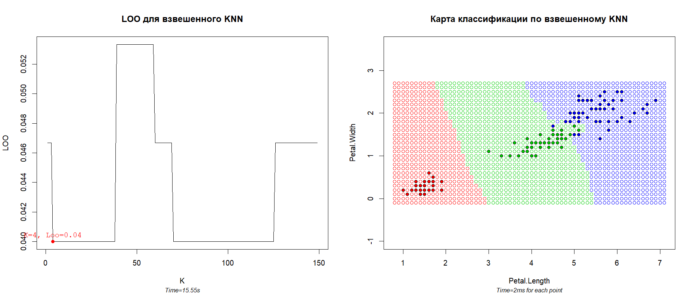
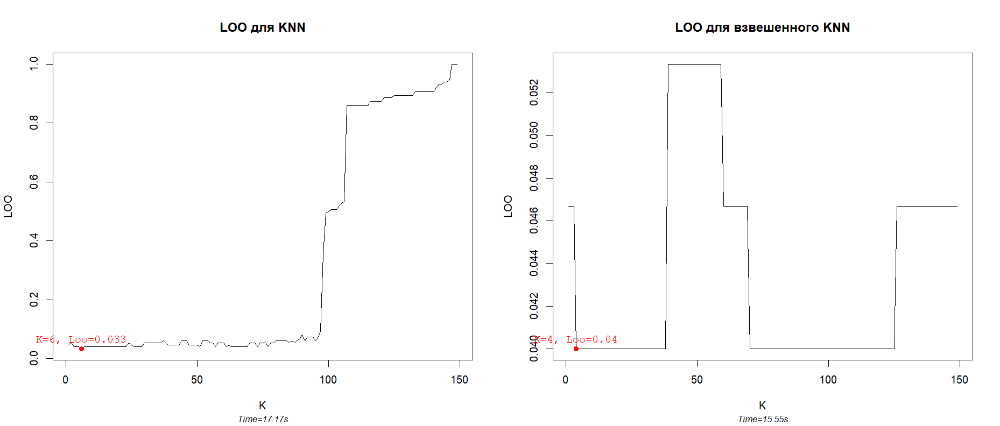

# Взвешанный KNN

### Теория

**Взвешанный KNN** - метрический алгоритм классификации, где в качестве оценки
близости объекта

к классу

выступает функция
![w(i,u) = [i <= k]w(i)](http://latex.codecogs.com/svg.latex?%5Clarge%20W_y%28i%2Cu%29%3D%5Bi%20%5Cleq%20k%5Dw%28i%29),
где

- 
— порядок ближайшего соседа к классифицируемой точке
;
- 
— вес относительно точки
, строго убывающая
функция.

Алгоритм **kwKNN** зависит от параметра _k_, который варьируется от
_k = 1_ (_1NN_) до _k = l_, и выбора весовой фунции. В нашем примере
была выбрана следующая функция:

Для определения лучшего параметра _k_ будем использовать **LOO (leave-one-out)**

### Программная реализация

Исходный код программы: [KwKNN.R](../KwKNN.R)

Код отличается от [KNN.R](../KNN.R) лишь функцией
`mc.KwKNN(sortedDistances, k)` (работает аналогично)
и наличием дополнительной весовой
функции `mc.KwKNN.w`.

Остальным же код полностью совпадает с [KNN.R](../KNN.R).

### Результат

Для классификации используется стандартная выборка ирисов Фишера по лепесткам.

Слева приведен график **LOO**, который подбирает оптимальный параметр _k_.
В данном случае оптимальным оказалось _k = 4_, имеющее ошибку _0.4_, что
соответсвует 6-ти неправильно классифицированным точкам.

Отличие качества классификации алгоритма **KwKNN** от **KNN** можно наблюдать
на следующей картинке:

Несмотря на то, что **KNN** дал ответ немного лучше, чем **KwKNN**, очевидно
преимущества второго алгоритма над первым. **KwKNN** не ухудшается при росте
_k_ и дает практически одинаковый результат при любом _k_. Это связано с тем,
что он учитывает не только наличие точки среди ближайших _k_-соседних, но
также и ее порядок. При чем функция устроена таким образом, что дальние
соседи очень быстро обесцениваются (отсюда и такое маленькое отклонение
лучшего результата от худшего).

----

[Вернуться в меню](../../README.md)

[Вернуться к KNN](KNN.md)

