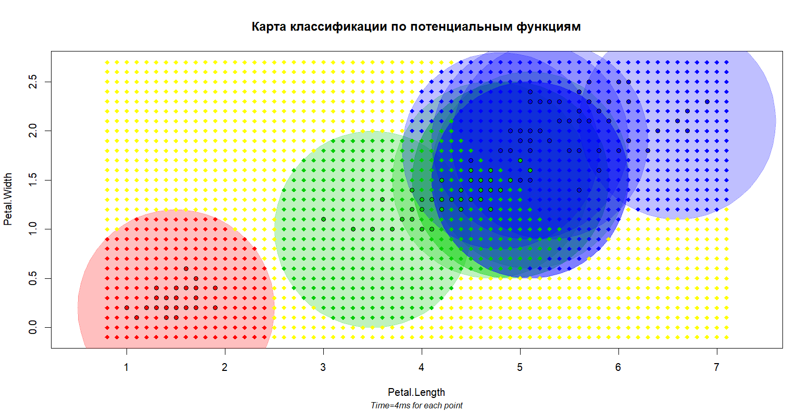

# Potential function

### Теория

**PF** - метрический алгоритм классификации, где в качестве оценки
близости объекта

к классу

выступает функция

,
где

- 
— радиус потенциала (предполагается, что известен заранее);

- 
— функция ядра (известна заранее);

- 
— величина потенциала (подбирается алгоритмом);

Алгоритм **PF** является двойственным алгоритму **PW** тем, что центр
классификации помещается не в неизвестную точку, а в обучающий объект _x_.

По идее, параметр _h_ (радиуса потенциалов) должен подбираться неким образом
до самого алгоритма, но пока сделаем его равным 1 для каждого объекта.

### Программная реализация

Исходный код программы: [PF.R](../PF.R)

Функция `mc.PF.potentials = function(points, classes, h,
mistakes.limit, log = F)` получает на вход известные объекты,
предпосчитанные радиусы потенциалов и количество
ошибкок, которые алгоритм может допустить на обучающей выборке. Возвращает
вектор величин потенциалов. Параметр `log` указывает, выводить ли функции
промежуточные данные рассчета (по умолчанию отключен).

Функция `mc.PF = function(distances, classes, potentials, h)`
классифицирует неизвестный объект `h`. Как и в предыдущем алгоритме
([PW](PW.md)), если объект находится за пределами <u>всех</u> окон,
он не классифицируется (функция возвращает `"no"`).

Отдельно следует обратить внимание на сложность и время выполнения
подбора параметров. Алгоритм считает параметры хорошо подобранными, когда
ошибка классификации достигает определенного значения. На каждой итерации
выбирается _x_ и если алгоритм на этом объекте ошибается, его потенциал
возрастает. Однако выбор этого самого _x_ осуществляется случайным образом.
В итоге, алгоритм _рандомизированный_, <u>предугадать количество итераций
невозможно</u>.

В конце каждой итерации необходимо подсчитать количество ошибок, тем самым
сложность каждой итерации составляет
. Учитавая, что
количество самих итераций <u>явно</u> не ограничено, алгоритм работает
значительно дольше своих предшественников.

На практике же, время работы также <u>значительно</u> увеличивается
за счет случайного поиска параметра, на котором алгоритм дает ошибку.

Алгоритм возможно немного (не асимптотически) ускорить. Для этого можно
не подсчитывать все ошибки, а перескакивать на следующую итерацию, если
их количетво уже превышает желаемое значение:

`if (mistakes.made > mistakes.limit) break`

Как ни удивительно, на практике это уменьшает время работы итерации на 1/3.

Также можно оптимизировать случайный поиск неверно классифицируемого
объекта — самая долгая операция, но делать я этого не стал.

### Результат

Для классификации используется стандартная выборка ирисов Фишера по лепесткам.

По умолчанию все _h_ были приравнены к 1. Величина потенциалов отмечается
на графике интенсивностью цвета (самый большой потенциал установлен в 0.5
для наглядности).

Время подбора параметров составило 166 секунд (12 итераций). С помощью
вышеописанной
эвристики время подбора можно сократить до 96 секунд. Однако даже
это в разы
больше времени работы предыдущих алгоритмов.

Стоит отметить, что при подборе ошибок их количество с каждой итерацией
<u>не обязательно</u> уменьшается. В данном примере ошибки образуют такую
последовательность:

100 ошибок, 56, 21, 21, 20, 14, **7, 14**, 7, 6, 6, 4

Таким образом есть риск, что при маленьком параметре `mistakes.limit`
алгортим может вовсе не завершиться. Все зависит от того, насколько удачно
будут _угадываться_ рассматриваемые _x_.

**ИМХО:** алгоритм очень "случаен". Он может как показать хорошие результаты
классификации, так и не найти оптимальных потенциалов вовсе.
Время работы также желает оставлять лучшего.

К тому же
появляется необходимость решать еще одну задачу: подбор параметра _h_.
При неудачно выбранном _h_ алгоритм может попросту не достигнуть
нужной нам точности классификации ни за какое время
(проверено личным опытом).

Как мне кажется, алгоритм довольно сырой, его недостатки кроятся в случайном
выборе _x_, из-за чего алгоритм может случайно увеличить потенциал
нежелательной точки, увеличивая тем самым время работы на несколько часов.
Я бы не стал его использовать.

----

[Вернуться в меню](../../README.md)

[Вернуться к PW](PW.md)

