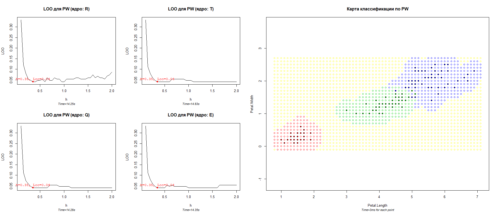

# Parzen window

### Теория

**PW** - метрический алгоритм классификации, где в качестве оценки
близости объекта

к классу

выступает функция

,
где

- 
— ширина окна (подбирается по критерию);

- 
— функция ядра (невозрастающая).

Алгоритм **PW** зависит от параметра _h_ и выбранного ядра.
Часто используемыми ядрами являются:
- _R_ прямоугольное;
- _T_ треугольное;
- _E_ епанечниково;
- _Q_ квартическое.

Для определения лучшего параметра _h_ будем использовать **LOO (leave-one-out)**.
Фукнция ядра можно не подбирать — они не сильно вляют на качество
классификации (в чем мы скоро убедимся).

### Программная реализация

Исходный код программы: [PW.R](../PW.R)

Листинг не сильно отличается от пердыдущих работ. Как прежде, 2 фукнции
подсчета, 2 функции отрисовки.

Функция `mc.PW(distances, classes, u, h)` получает на вход массив расстояний,
массив ответов, точку, необходимую классифицировать `u`, и ширину окна `h`.
Возвращает имя предполагаемого класса.

Однако используется файл [kernelHelp.R](../kernelHelp.R), он хранит в себе
4 функции ядра, которые будут использованы в ходе вычислений.

### Результат

Для классификации используется стандартная выборка ирисов Фишера по лепесткам.

Слева приведены 4 графика **LOO** для каждого ядра. Несмотря на небольшие
отличия, оптимальное _h_ во всех 4-х случаях одинаковое. Из всех ядер в
качестве классификации немного уступает лишь прямоугольное ядро (из-за своей
~~чрезмерной~~ простоты).

У алгоритма есть существенный недостаток — он не способен ~~адекватно~~
классифицировать все точки. Так как ширина окна _h = 0.35_, существуют точки,
для которых в их радиусе не окажется ни одной известной точки. В таком случае эти самые
точки могут принадлежать любому классу (они помечены желтым цветом
на карте). Это качественно отличает **KNN** и **KwKNN** от **PW**.

Однако, у **PW** есть и свои преимущества. Он не требует сортировки и
берет все точки с одинаковым расстоянием.

----

[Вернуться в меню](../../README.md)

[Вернуться к KwKNN](KwKNN.md)

