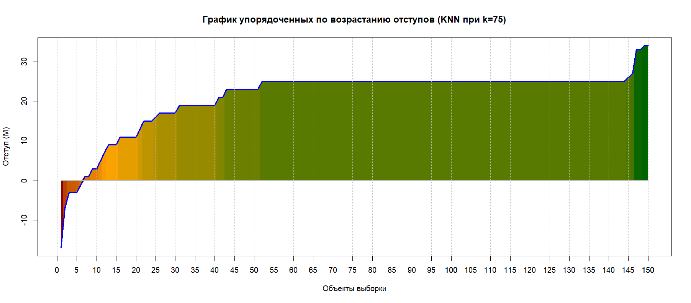
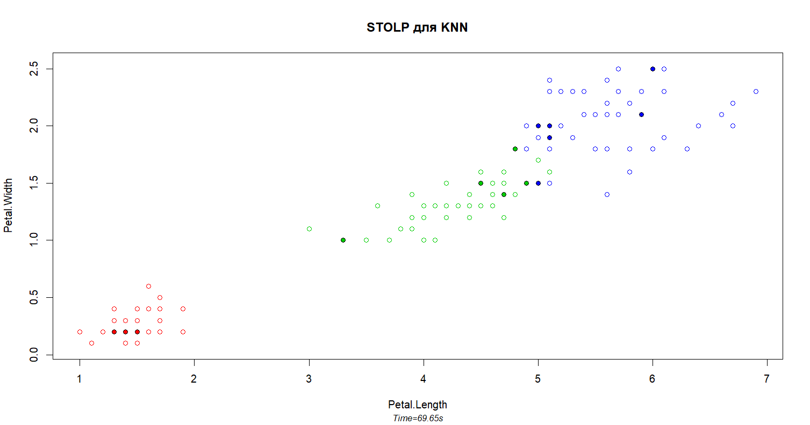

# STOLP

### Теория

Обычно объекты обучения не являются равноценными. Типичные представители
своего класса называются _эталонами_. _Неинформативные_ объекты при удалении
из выборки практически не влияют на качество классификации, они плотно
окружены объектами другого класса. И наконец, _шумовые_ объекты как правило
попадают в выборку по ошибке и негативно сказываются на качестве
классификации. При их удалении качество лишь увеличивается. Такие объекты
находятся "в толще" объектов других классов.

Алгоритм **STOLP** производит сжатие данных, удаляя из выборки все
неэталонные объекты. Таким образом при использовании "очищенной" выборки
в алгоритмах классификации происходит экономия времени и памяти и
качество классификации при этом не падает (а
если много _шумовых_ объектов даже может вырости).

**STOLP** использует понятие отступа (типичность объекта):

, где

— какая-нибудь весовая функция.

Весовая функция зависит от алгоритма классификации, на котором она будет
использована. Мы будем "улучшать" обучающую выборку алгоритма **KNN**,
поэтому весовая функция будет соответствовать [i <= k].

### Программная реализация

Исходный код программы: [STOLP.R](../STOLP.R)

Для определения "полезности" объекта воспользуемся функцией отступа
`mc.STOLP.margin = function(points, classes, u, class)`, где `u` —
неизвестная точка, а `class` — её класс.

Сам же алгоритм **STOLP** вызывается
`mc.STOLP = function(points, classes, noise.bound, mistakes.limit)`.
`noise.bound` — граница _шумовых_ объектов, если отступ объекта будет ниже
или раввен этой отметке, он сразу отбрасывается алгоритмом.
`mistakes.limit` — количество ошибок, которые может допустить алгоритм.

Для тестирования алгоритма **STOLP** на выборке ирисов Фишера для **KNN**
установим следующие параметры: `k = 6`, `noise.bound = -2`,
`mistakes.limit = 5`. Поясним такой выбор параметров. Во время
[тестирования](KNN.md) **KNN** с помощью **LOO** выяснилось, что лучший
результат (5 ошибок) алгоритм показал при `k = 6`. Мы хотим убедиться,
что алгоритм способен "сжать" выборку, не ухудщая при этом свои
характеристики. Этим обусловлен выбор параметров `k` и `mistakes.limit`.
Так как некоторые классы в выборке ирисов Фишера "налезают" друг на
друга, параметр `noise.bound` не следует делать равным 0, так как это
может удалить спорные объекты и ухудшить качество в местах соприкосновения
классов. Поэтому сделаем его чуть меньше нуля, -2 (см. ниже).

Алгоритм работает до выполнения определенного условия. Каждая итерация
имеет сложность
.
Однако алгоритм быстро сходится и в худшем
случае завершится на _N_ итераций.

### Результат

Для классификации используется стандартная выборка ирисов Фишера по лепесткам.

Прежде рассмотрим распределение типов точек в зависимости от величины
отступа на следующем графике:

К сожалению, точного критерия принадлежности точки к тому или иному классу
нет, поэтому разделим точки условно.

- Точки с отступом -2 и ниже отнесем к _шумовым_ (их 5 штук).
- Точки с 6-й по 10-ю отнесем к _пограничным_ (5 штук).
- Точки с с 11-й по 14-ю к _неинформативным_ (4 штуки).
- Точки с 15-й по 150-ю к _эталонным_ (136 штук)!!!

Такое распределение не считается типичным (эталонных объектов в выборке)
оказалось слишком много, а неинформативных мало. Это связано с выбором
алгоритма классификации __KNN__ и параметра __k__
(объектов в окружении 6-ти своего класса слишком много).
Однако, стоит заметить,
что объектов с отрицательным отступом мало, а с большим положительным – много.
Это означает, что есть смысл применить алгоритм __STOLP__.

В качестве доказательтсва правильности определения отступов, возьмем
тот же алгоритм, но при __k=75__:

Тут всего 4 эталонных объекта и большинство неинформативных.

__STOLP:__

Время работы алгоритма составило 69 секунд (13 итераций). Сама же
выборка уменьшилась в 10 раз, оставляя в каждом классе примерно по пять
представителей из 50-ти (у "setosa" 4 представителя, один объект
дублируется 2 раза). 5 из 150-ти точек отбросились алгоритмом сразу
как _шумовые_.

Как можно видеть по результатам сравнения **KNN** на сжатой и полной выборке,
все 5 неправильно классифицированных точек расположены в "спорной зоне",
где классы соприкосаются друг с другом. На практике
алгоритм на сжатой выборке отрабатывает в 5 раз быстрее и потребляет
в 10 раз меньше памяти.
При этом качество классификации осталось на том же уровне.

----

[Вернуться в меню](../../README.md)

[Вернуться к PF](PF.md)

