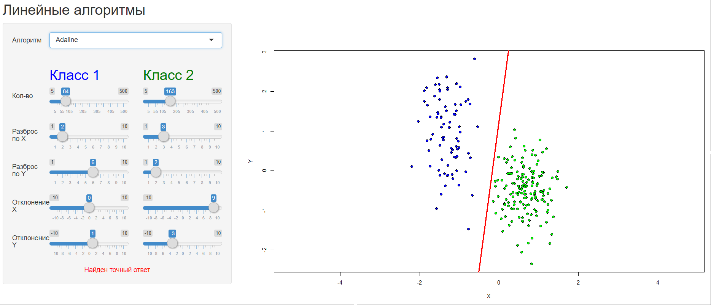
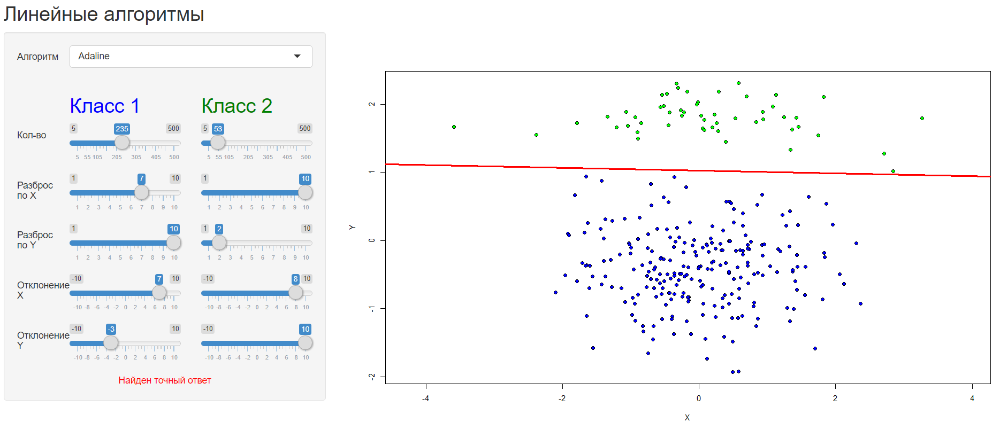

# Adaline

### Теория

**Adaline** - линейный алгоритм классификации, основанный на методе
__[стохастического градиента](stoh.md)__
с __квадратичной функцией потерь__: 
.

Отсюда
.

Таким образом получаем _правило обновления весов_ или другими словами
_дельта-правило_:
.

### Программная реализация

Исходный код программы: [Adaline/server.R](../Adaline/server.R)

На основе данных:

- размеров классов
- мат. ожидания (смещение по _х_ и _y_)
- ковариационной матрицы (растяжение по _x_ и _y_)

программа генирирует объекты из

для двух классов с <u>нормально распределенными параметрами</u>.

Далее, используя [метод стохастического градиента](stoh.md),
подбираем вектор весов. 

### Результат

Программа реализована с помощью библиотеки *shiny*, которая реализует
интерфейс для задания параметров. Так что параметры пользователю
предлагается выбрать самому.

Программа доступна по
[ссылке](https://dmitriypenetrator.shinyapps.io/adaline/)

Некоторые примеры:

1) Выборки возможно точно разделить прямой.

2) Выборки невозможно разделить прямой.

3) Прямая не проходит через начало координат.

----

[Вернуться в меню](../../README.md)

