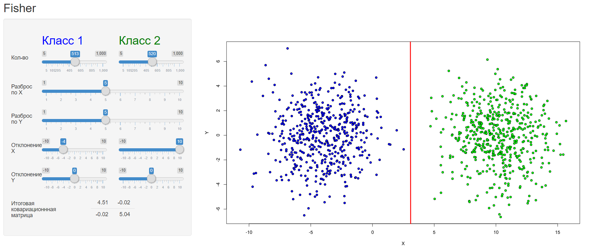
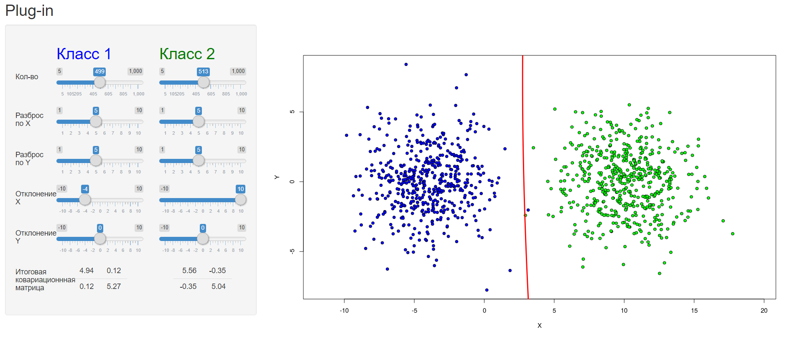
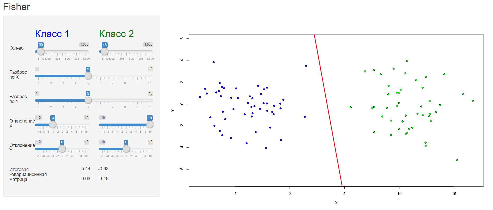
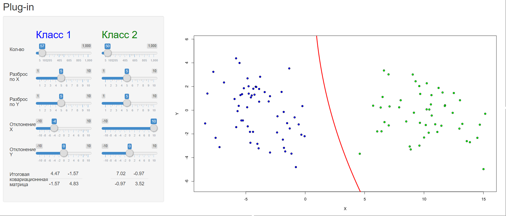
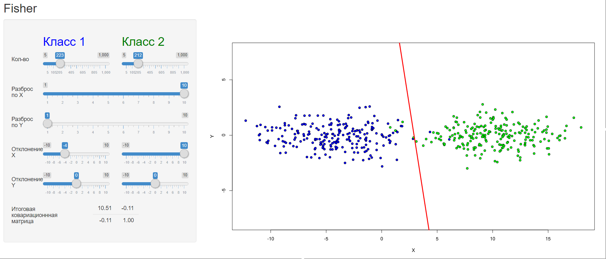
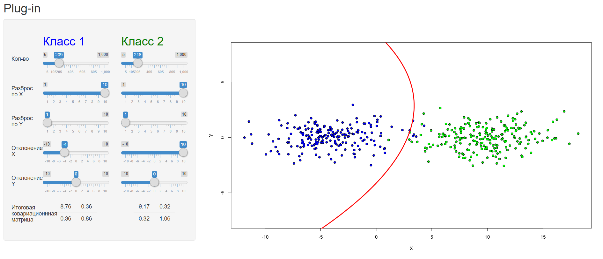

# Линейный дискриминант Фишера

### Теория

**ЛДФ** - байесовский алгоритм классификации, который основан на алгоритме
**plug-in** с новым предположением:
<u>ковариационные матрицы классов равны</u>.
В случае, когда это условие действительно выполняется, **ЛДФ** показывает
себя лучше **plug-in** алгоритма, а сам алгоритм стовится более прозрачным.

Если ковариационные матрицы классов равны, в таком случае мы можем оценить

по всем _l_ объектам выборки:

Так как матрицы равны, то по _теореме о квадратичном дискриминанте_,
разделяющая поверхность линейна, и представляет собой уравнение вида:

,
где

### Программная реализация

Исходный код программы: [Fisher/server.R](../Fisher/server.R)

На основе данных:

- размеров классов
- мат. ожидания (смещение по _х_ и _y_)
- ковариационной матрицы (растяжение по _x_ и _y_)

программа генирирует объекты из

для двух классов с <u>нормально распределенными параметрами</u>.

<u>Отличие от **plug-in** в том, что матрица общая на 2 класса,
как того требует условие **ЛДФ**</u>.

После по полученным выборкам строятся новые

и
,
и между классами проводится *разделяющая поверхность*.

### Результат

Программа реализована с помощью библиотеки *shiny*, которая реализует
интерфейс для задания параметров. Так что параметры пользователю
предлагается выбрать самому.

Программа доступна по
[ссылке](https://dmitriypenetrator.shinyapps.io/fisher/)

Сравним результаты классификации **plug-in** и **ЛДФ**
при одинаковых данных: 

1) Дисперсии признаков обоих классов одинаковы:

2) Дисперсии одинаковы, мало объектов в классах:

3) Дисперсии разные

Из сравнения видно, что **ЛДФ** справляется с задачей классификации
гораздо лучше, чем его соперник. Разделяющая поверхность **ЛДФ**
всегда остается прямой (что удовлетворяет теореме), а **plug-in**
часто выраждается в параболу. И ковариационная матрица **ЛДФ**
отклоняется от исходной меньше, чем матрица **plug-in**.
Причем, чем "жестче" условия классификации,
тем выгодней смотрится **ЛДФ**.

Недостатком ЛДФ можно назвать узкую сферу его применения.
Классы должны быть очень похожи друг на друга для удовлетворительной
классификации.

----

[Вернуться в меню](../../README.md)

[Вернуться к Подстановочнуму алгортиму](plug-in.md)

