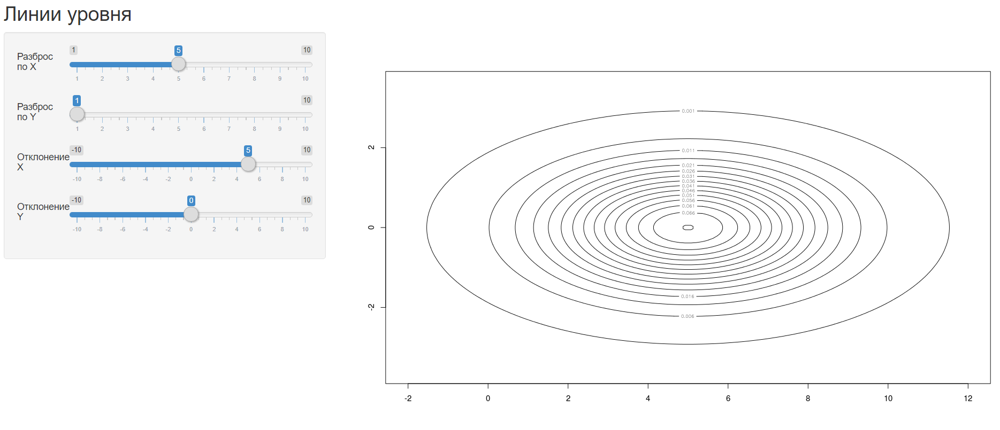
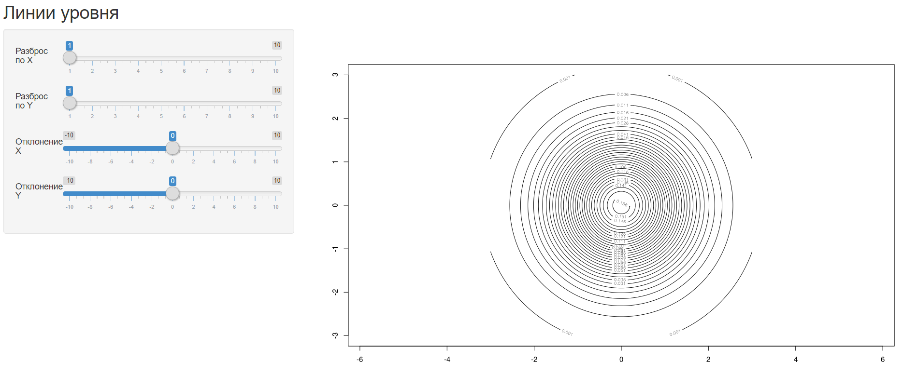
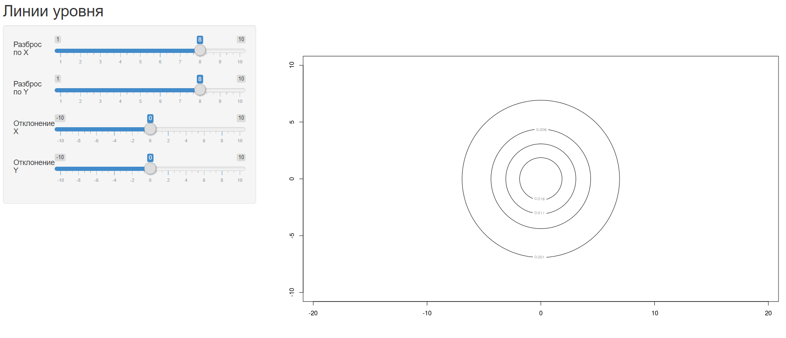

# Линии уровня

### Теория

**Нормальный дискриминантный анализ** - частный случай баесовской классификации,
когда предполагается, что плотности всех классов являются многомерными нормальными:

,

где 
– объект выборки, имеющий *n* признаков,

– математическое ожидание (центр выборки),

– ковариационная матрица (симметричная, невырожденная, положительно
определенная).

### Программная реализация

Исходный код программы: [Levels/server.R](../Levels/server.R)

Программа на основе математического ожидания и ковариационной матрицы
изображает распределение линий уровня с вероятностями от 0,001 до 0,2.

Ковариационная матрица влияет на наклон, а также растяжение линий уровня по осям
координат. Вектор мат. ожидания влияет на расположение центра линий уровня.

### Результат

Программа реализована с помощью библиотеки *shiny*, которая реализует
интерфейс для задания параметров. Так что параметры пользователю
предлагается выбрать самому.

Программа доступна по
[ссылке](https://dmitriypenetrator.shinyapps.io/levels/)

Некоторые примеры:

1) Если признаки _некоррелированы_, линии уровня плотности распределения
имеют форму элипсоидов с центром в точке

и параллельны осям координат.

2) Если признаки имеют одинаковые дисперсии, то элипсоиды являются сферами

3) Чем больше значение матрицы ковариации, тем больше растяжение и класс становится
менее плотным.

----

[Вернуться в меню](../../README.md)

[Перейти к подстановочному алгоритму](plug-in.md)

