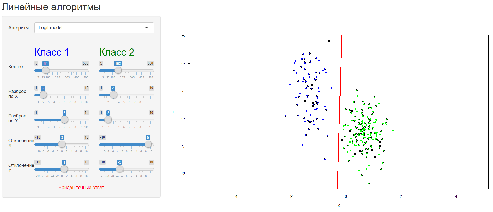
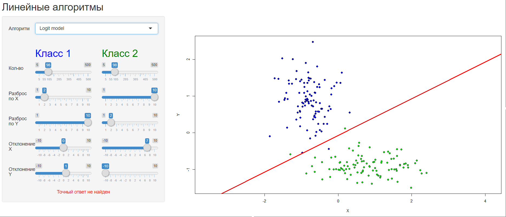
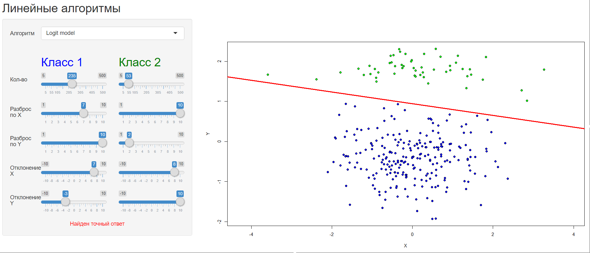

# Logit model

### Теория

**Logit model** - линейный алгоритм классификации, также являющийся оптимальным
байесовским. Основан на методе __[стохастического градиента](stoh.md)__
и довольно сильных вероятностных предположениях.
Имеет __логистическую функцию потерь__: 
.

__Правило обновления весов__ называется _логистическим правилом_ и выглядит следующим
образом:

, где

– _сигмоидная функция_.

### Программная реализация

Исходный код программы: [Linear/server.R](../Linear/server.R)

На основе данных:

- размеров классов
- мат. ожидания (смещение по _х_ и _y_)
- ковариационной матрицы (растяжение по _x_ и _y_)

программа генирирует объекты из

для двух классов с <u>нормально распределенными параметрами</u>.

Далее, используя [метод стохастического градиента](stoh.md),
подбираем вектор весов. 

### Результат

Программа реализована с помощью библиотеки *shiny*, которая реализует
интерфейс для задания параметров. Так что параметры пользователю
предлагается выбрать самому.

Программа доступна по
[ссылке](https://dmitriypenetrator.shinyapps.io/adaline/)

Некоторые примеры (выборки одинаковы для всех линейных классификаторов):

1) Выборки возможно точно разделить прямой.

2) Выборки невозможно разделить прямой.

3) Прямая не проходит через начало координат.

----

[Вернуться к персептрону Розенблата](perseptron.md)

[Вернуться в меню](../../README.md)

