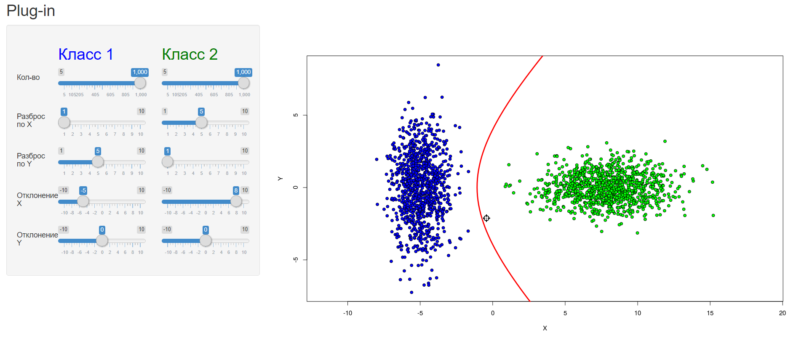
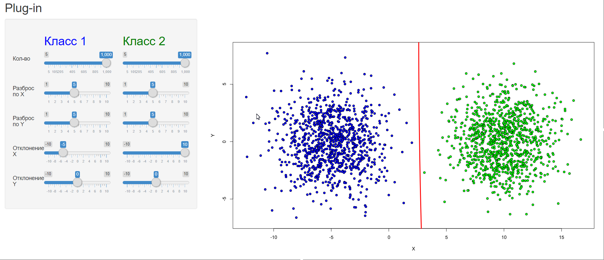
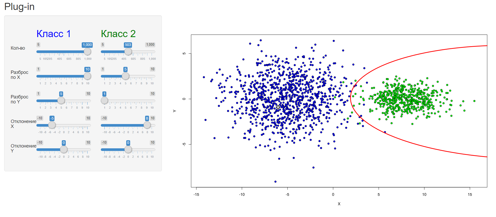

# Plug-in

### Теория

**Plug-in** - байесовский алгоритм классификации, в котором в качестве
моделей восстанавливаемых плотностей рассматривают многомерные
<u>нормальные плотности</u>:

,

где 
– объект выборки, имеющий *n* признаков,

– математическое ожидание (центр выборки),

– ковариационная матрица (симметричная, невырожденная, положительно
определенная).

Восстанавливая параметры

для каждого класса и подставляя в оптимальный байесовский
классификатор получаем **plug-in**.

Эти параметри оцениваются по следующим формулам:

,

которые выполняются для объектов каждого класса,
где *m* – количество объектов в данном классе.

### Программная реализация

Исходный код программы: [Plug-in/server.R](../Plug-in/server.R)

На основе данных:

- размеров классов
- мат. ожидания (смещение по _х_ и _y_)
- ковариационной матрицы (растяжение по _x_ и _y_)

программа генирирует объекты из

для двух классов с <u>нормально распределенными параметрами</u>.

После по полученным выборкам строятся новые

и
,
и между классами проводится *разделяющая поверхность*.

### Результат

Программа реализована с помощью библиотеки *shiny*, которая реализует
интерфейс для задания параметров. Так что параметры пользователю
предлагается выбрать самому.

Программа доступна по
[ссылке](https://dmitriypenetrator.shinyapps.io/plug-in/)

Некоторые примеры:

1) Если признаки _некоррелированы_, линии уровня плотности распределения
имеют форму элипсоидов с центром в точке

и параллельны осям координат.

2) Если признаки имею одинаковые дисперсии, то элипсоиды являются сферами

3) Пример, когда менее плотный класс окружен более плотным

Это простые примеры, для которых __Plug-in__ хорошо работает, однако
на более сложных выборках он показывает неудовлетворительные результаты.
В частности:

- Классы, которые распадаются на изолированные сгустки
- Если присутствуют линейно зависимые признаки, матрица становится
вырожденной и решений алгоритм не дает
- Если признаки почти линейно зависимы, матрица _плохо обусловлена_ и
алгоритм дает большие погрешности

----

[Вернуться в меню](../../README.md)

[Сравнить с Линейным дискриминантом Фишера](fisher.md)

